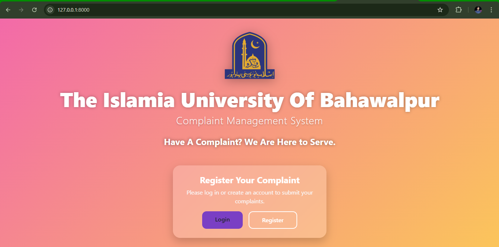
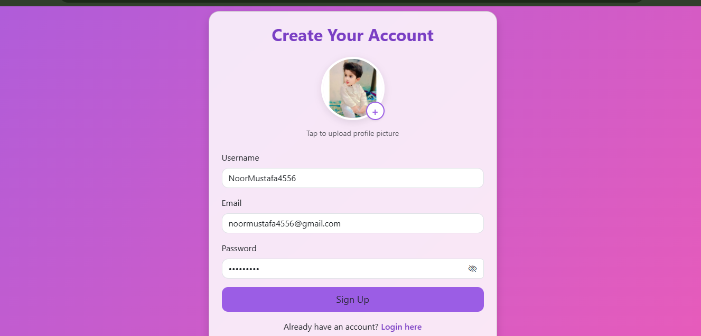
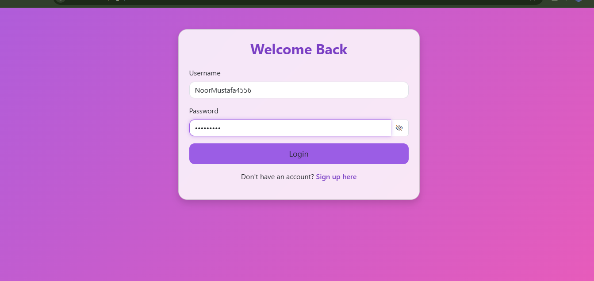
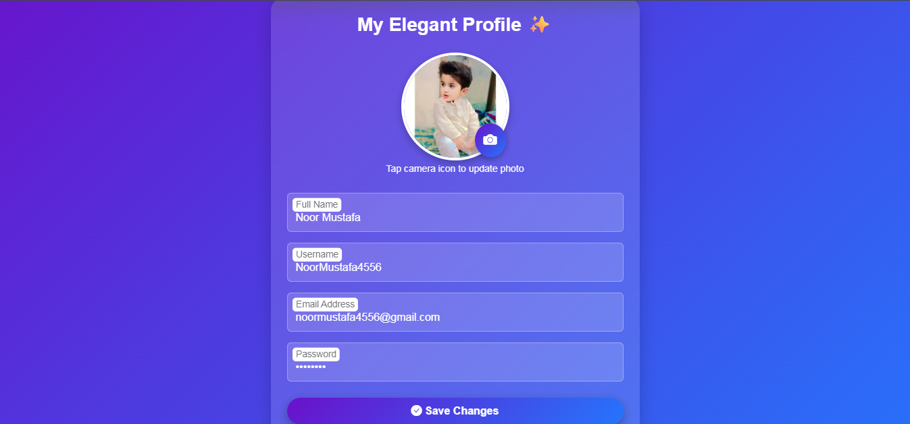
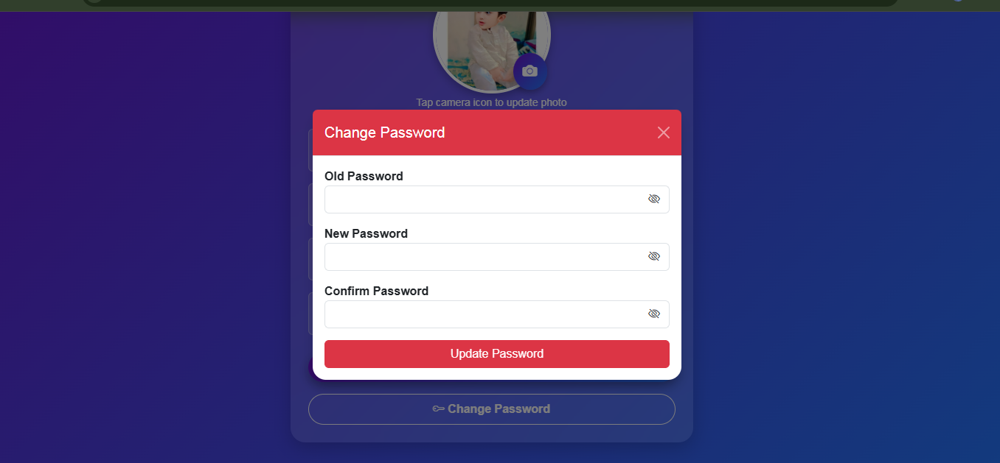
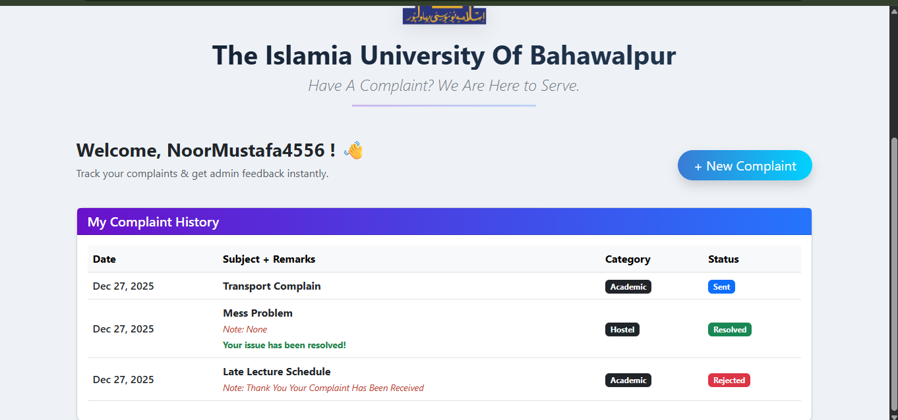
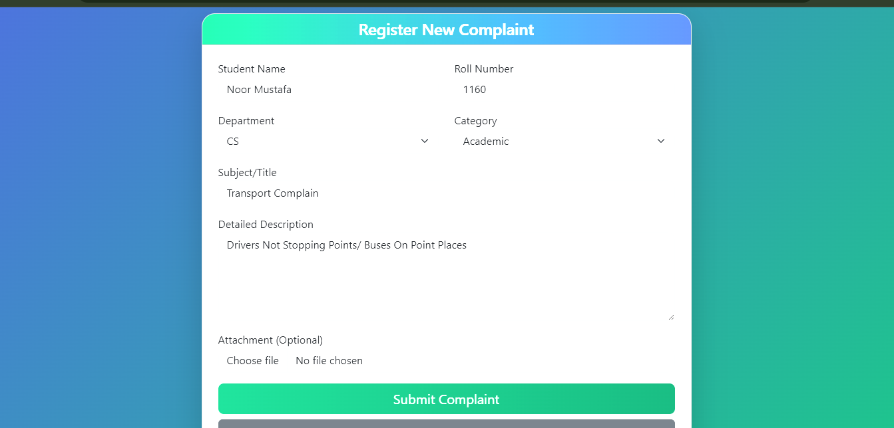
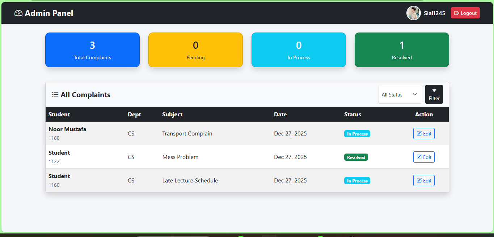

# 🎓 University Complaint Management System (UCMS)

**UCMS** is a robust, web-based platform designed to bridge the gap between students and university administration. It streamlines the entire complaint lifecycle—from submission to resolution—ensuring every grievance is heard, tracked, and resolved efficiently.

Built with **Django**, the system features a secure, role-based architecture with a responsive UI, offering a seamless experience for both students and administrators.

---


## 🚀 Key Features

- **Role-Based Dashboards** – Dedicated panels for Students and Administrators.
- **Smart Complaint Tracking** – Real-time status updates (Sent &rarr; Pending &rarr; In Process &rarr; Resolved/Rejected).
- **Secure Authentication** – Login, Signup, and Password Management with security lockouts.
- **Complaint Evidence** – Support for image attachments to substantiate complaints.
- **Admin Power Tools** – Advanced filtering by Department (CS, IT, SE) and Status.
- **Responsive Design** – Optimized for desktops, tablets, and mobile devices.
- **Automated Profiling** – Instant profile generation for new users.

---

### 🔐 Role-Based Access
- **Students** &rarr; Register complaints, track status, view history, and manage profiles.
- **Admins** &rarr; Oversee all complaints, update statuses, add remarks, and analyze data.

### 🔎 Smart Filtering & Search
- **Admins** can filter complaints by:
  - **Status** (Pending, Resolved, etc.)
  - **Department** (CS, IT, SE, Management)

### 👤 Secure Account Management
- **Profile Updates:** Name, Email, Profile Picture.
- **Security:** Password change with a 3-attempt lockout mechanism for enhanced security.

---

## 🛠 Tech Stack

| Area | Technology |
| :--- | :--- |
| **Backend Framework** | Django 5.x (Python) |
| **Frontend** | HTML5, CSS3, Bootstrap 5.3 |
| **Database** | SQLite (Default) |
| **Image Processing** | Pillow |
| **Templating** | Django Template Engine (DTL) |
| **Authentication** | Django Auth System |

---

## 📸 App Screenshots

<p align="center">
  
  
  
  
  
  
  
  
</p>

---

## 🔧 Getting Started

### Prerequisites
- Python 3.8+
- Git

**1. Clone the repository:**
```bash
git clone https://github.com/NoorMustafa4556/UCMS-University-Complaint-Management-System.git
```
### Navigate To Directory
```bash
cd UCMS-University-Complaint-Management-System
```

**2. Create and activate a virtual environment:**
```bash
python -m venv env
```
## Windows
```bash
.\env\Scripts\activate
```

## Mac/Linux
```bash
source env/bin/activate
```

**3. Install dependencies:**
```bash
pip install -r requirements.txt
```

**4. Apply migrations:**
```bash
python manage.py makemigrations
```
```bash
python manage.py migrate
```

**5. Create a Superuser:**
```bash
python manage.py createsuperuser
```

**6. Run the server:**
```bash
python manage.py runserver
```

---

# 👋🏻 Hi, I'm Noor Mustafa

A passionate and results-driven **Software Developer** from **Bahawalpur, Pakistan**, specializing in building elegant, scalable, and high-performance applications using **Django** and **Flutter**.

With a strong understanding of **Full-Stack Development**, **UI/UX principles**, and **API integration**, I aim to deliver solutions that are not only functional but also user-centric and visually compelling.

---

## 🚀 What I Do
- 💻 **Web Development** – Building robust web apps with Django & React.
- 📱 **Mobile App Development** – Creating cross-platform apps with Flutter.
- 🔗 **API Integration** – Connecting frontends to powerful RESTful APIs.
- 🔐 **Secure Systems** – Implementing secure authentication and role-based access.

---

## 🌟 Projects I'm Proud Of
- 🩸 **[Blood Link](https://github.com/NoorMustafa4556/Blood-Link-App-Flutter)** – A modern blood donation app connecting donors and recipients.
- 🎓 **[UCMS](https://github.com/NoorMustafa4556/UCMS-University-Complaint-Management-System)** – A comprehensive university complaint management system.
- 🌤 **[Live Weather Check](https://github.com/NoorMustafa4556/Live-Weather-Check-App)** – Real-time weather forecast functionality.
- 🤖 **[AI Chatbot](https://github.com/NoorMustafa4556/Ai-ChatBot)** – Conversational AI powered by Google Gemini.

> 🎯 Check out all my repositories on [github.com/NoorMustafa4556](https://github.com/NoorMustafa4556?tab=repositories)

---

## 🧰 Tech Toolbox

<p align="left">
  
  
  
  
  
  
  
  
</p>

---

## 📫 Let's Connect!

<p align="left">
  <a href="https://x.com/NoorMustafa4556" target="blank">
    
  </a>
  <a href="https://www.linkedin.com/in/noormustafa4556/" target="blank">
    
  </a>
  <a href="https://www.facebook.com/NoorMustafa4556" target="blank">
    
  </a>
  <a href="https://instagram.com/noormustafa4556" target="blank">
    
  </a>
  <a href="https://wa.me/923087655076" target="blank">
    
  </a>
  <a href="https://www.tiktok.com/@noormustafa4556" target="blank">
    
  </a>
</p>

- 📍 **Location:** Bahawalpur, Punjab, Pakistan

---

> “Creating systems that solve real-world problems, one line of code at a time.”

---
